# Postgres connection queuing lab

## Why this project exists

Large microservice systems often have many application pods sharing one PostgreSQL database. Every pod owns a local connection pool, so scaling from 10 pods to 50 can multiply the number of potential database clients even when PostgreSQL capacity has not changed.

During a traffic burst, requests can arrive faster than queries finish. They begin waiting in the Node pool, PgBouncer, PostgreSQL, or several of those layers in sequence. A slow transaction can occupy a backend connection, while CPU-heavy synchronous JavaScript can block an entire Node process even when database connections remain available. Both failures appear to users as slow APIs and timeouts, but they require different fixes.

Teams often respond by increasing pool sizes, raising timeouts, adding retries, or scaling pods. Those changes can move the waiting elsewhere, multiply PostgreSQL connections, or make overload last longer. This repository exists to replace those temporary fixes with controlled experiments and measured evidence.

The project is intended to answer questions such as:

- Where is each request waiting: Node, PgBouncer, PostgreSQL, or the event loop?
- When does PgBouncer reuse connections, and when does it only provide another queue?
- How do bursts differ from sustained requests per second?
- How does horizontal scaling change the total connection budget?
- Why can one CPU-heavy Node request delay unrelated APIs?
- When should work wait, fail quickly, move to a worker, or receive isolated capacity?

Each experiment changes one variable, records raw timings and infrastructure state, and adds a short lesson note. This is a learning and diagnostic lab rather than a production capacity benchmark.

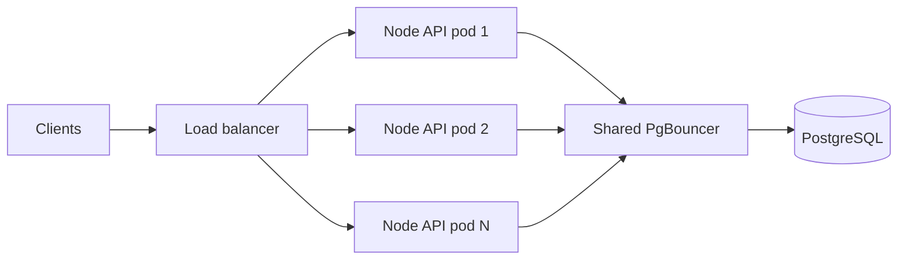

The same user-visible latency can originate at several different points:

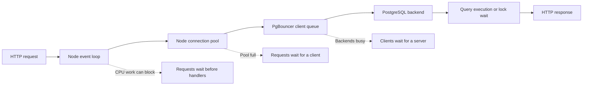

## Learning dashboard

The small Next.js UI reads the latest saved experiment JSON files from `results/`:

```sh
npm --prefix dashboard install
npm --prefix dashboard run dev
```

Open `http://localhost:3000`. Rerun an experiment, then refresh the page to see its newest result.

The interactive autoscaling lab at the top of the dashboard lets you change incoming requests/second, block one Node pod, play or scrub the timeline, and watch readiness, HPA startup delay, queue growth, PgBouncer capacity, and recovery end to end. Its timings and capacity are explicit teaching assumptions rather than Kubernetes defaults.

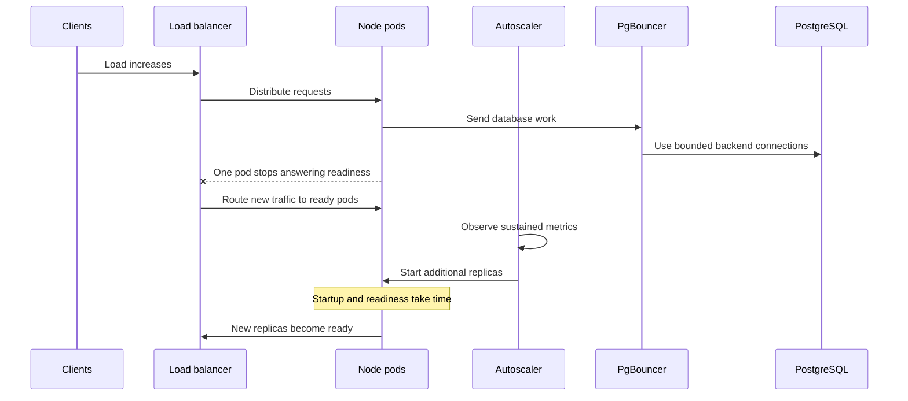

First lesson: **find where a request waits**. Run predictable faults, collect evidence, then change one setting at a time.

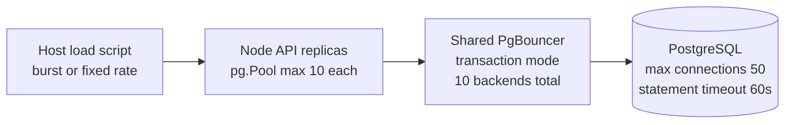

Docker Compose represents separate API processes with CPU/memory limits. It does not run Kubernetes or an autoscaler. The host load script distributes requests round-robin across discovered replicas. There is no proxy, service mesh, or production network in this first lesson. All replicas and the database share one Docker Desktop VM.

## Run the first lesson

Requires Docker Compose and Node 20+ on the host. `pg` is the only direct npm dependency; the HTTP server, load generator, and timing use Node built-ins.

```sh
npm ci
npm run up
npm run lab
```

The suite runs a fast baseline, slow SQL, blocking JavaScript, and slow SQL with three API replicas. It restores one API replica afterward. Open `results/latest-report.md` and the linked JSON measurements. These are small demonstrations; repeat longer runs before making capacity decisions.

```sh
# A simultaneous burst of 40 users, each making one slow request.
npm run experiment -- burst '/slow?ms=500' 40

# 200 arrivals at 20 requests/second, regardless of response speed.
npm run experiment -- fixed-rate '/slow?ms=500' 200 20

# Horizontal scaling: three processes, each with its own pool of 10.
docker compose up -d --scale api=3 --wait
npm run experiment -- three-replicas '/slow?ms=500' 40

# Restore one process.
docker compose up -d --scale api=1 --wait

# Stop this lab's containers.
npm run down
```

These commands assume the default configuration. Environment overrides persist if exported in your shell or placed in `.env`; raw results capture the API's relevant configuration. `npm run lab` changes replica count, not other settings. Run experiments one at a time.

## Request-count experiment

Second lesson: vary **requests arriving together**, holding the rest fixed:

```sh
docker compose up -d --scale api=1 --wait
npm run lab:requests
```

This runs bursts of 5, 10, 20, 40, and 80 requests with 500ms SQL work per request. It requires the default Node/PgBouncer connection limits of 10 and checks that configuration. Read `results/request-count-report.md` for predicted versus measured drain time, response latency, and queue size. HTTP load-script probes are disabled for this comparison so they do not add database workload requests. This tests burst size; arrival rate is a separate variable.

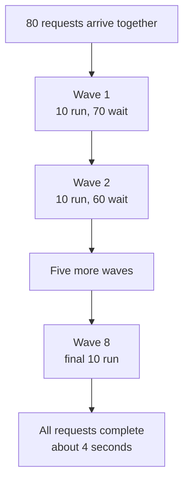

## Arrival-rate experiment

Keep 80 requests and 500ms SQL work fixed, then change how quickly requests arrive:

```sh
docker compose up -d --scale api=1 --wait
npm run lab:rate
```

The cases are 5, 10, 15, 20, and 30 requests/second plus an all-at-once burst. With 10 connections and fixed 500ms occupancy, the simple predicted service rate is 20 requests/second. Read `results/arrival-rate-report.md` to see where acquisition waiting begins to accumulate. This comparison also records actual dispatch timing so load-generator delay is visible.

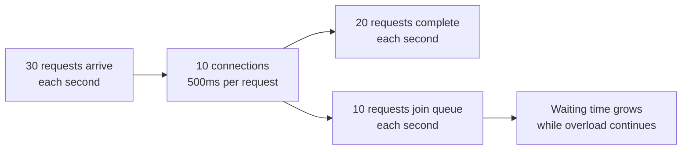

## Event-loop impact experiment

Schedule one two-second CPU block, then send nine normal database requests into the same Node process:

```sh
npm run lab:event-loop
```

The script compares those nine requests with a baseline and samples PgBouncer while Node is blocked. It separates client-visible latency from handler and database time. Read `results/event-loop-impact-report.md`, then refresh the dashboard.

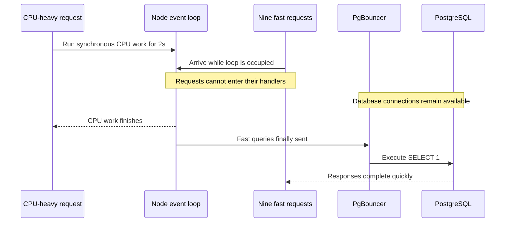

An asynchronous external call behaves differently:

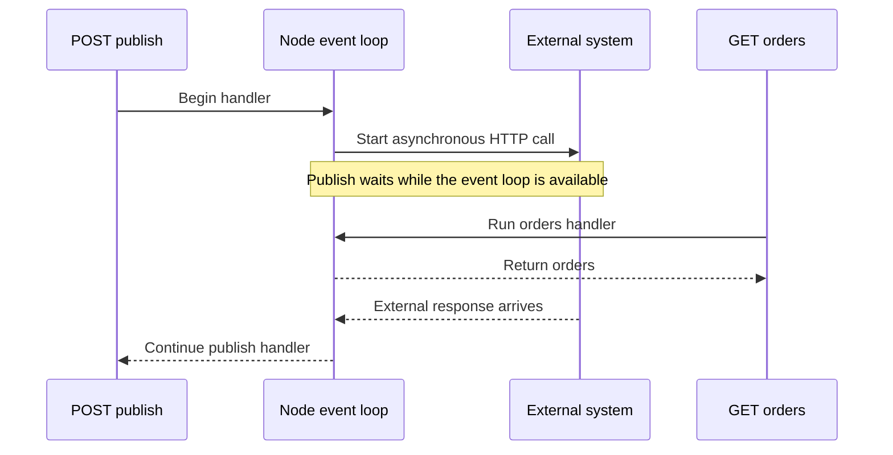

## How PgBouncer reuses connections

Transaction pooling keeps client connections separate from PostgreSQL backend connections. A backend is assigned for a transaction and returned afterward for another client.

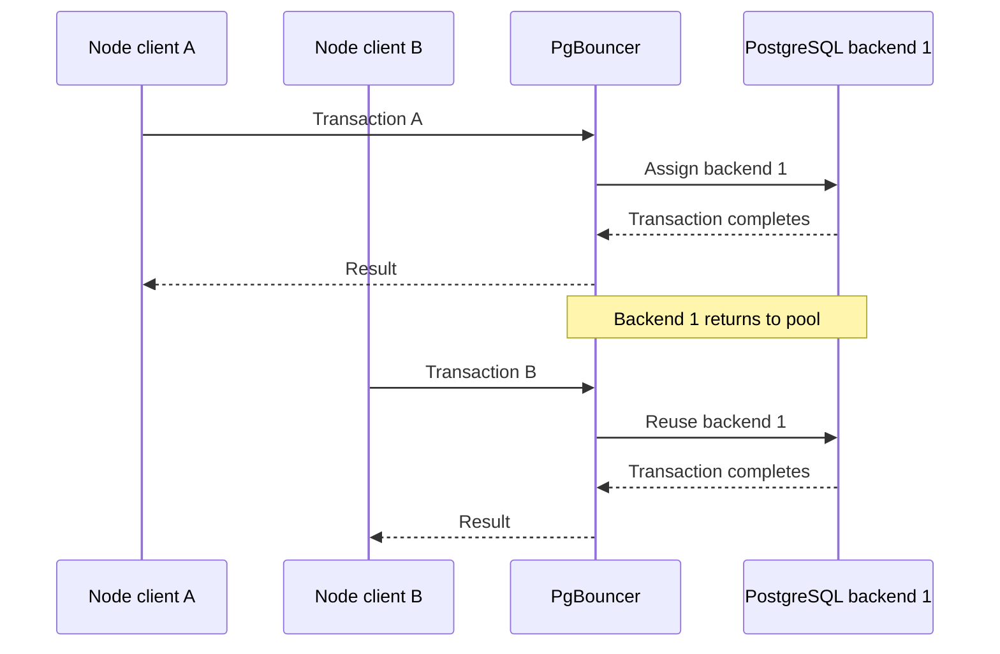

When every backend is busy, reuse becomes waiting:

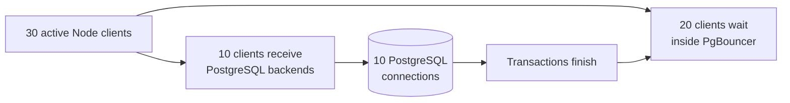

## What to read

- `lab/api.mjs`: `/fast` executes `SELECT 1`; `/slow?ms=500` executes `pg_sleep`; `/cpu?ms=150` deliberately blocks JavaScript; `/health` needs no DB. `/metrics` exposes pool and event-loop measurements.
- `lab/pgbouncer.ini`: explicit shared backend budget and transaction pooling. Rebuild PgBouncer after changing it: `docker compose up -d --build pgbouncer`.
- `scripts/experiment.mjs`: request timings, independent database observations, and raw JSON output.
- `compose.yaml`: topology, resource limits, and timeout configuration.

Discover an API's address with `docker compose port --index 1 api 3000`, then open `/health` or `/metrics` on that address. Host Postgres is at `127.0.0.1:55439`; PgBouncer is at `127.0.0.1:56439`. Credentials are disposable lab credentials in Compose. There is no seeded business dataset yet.

## Read the measurements correctly

| Measurement | What it tells us |
|---|---|
| Request latency | Time seen by the host client, including HTTP dispatch and response body |
| `acquireMs` | Time until Node obtains a pool client; also includes setup/scheduling overhead |
| `dbRoundTripMs` | PgBouncer waiting + SQL + transport + Node callback scheduling; **not SQL execution time alone** |
| `peakNodeWaiting` | Highest recorded acquisition queue in any one API replica |
| `peakBouncerWaiting` | Highest sampled `SHOW POOLS.cl_waiting` for the lab database |
| `samples` from Postgres | Backend state and wait events, observed using one extra direct DB connection |
| Health latency / loop delay | Whether requests without database work are also delayed |
| `/fast` probe latency | Whether slow requests delay unrelated short database work |

The script sends health and fast-SQL probes every 100ms, distributing them over replicas. These add load; short baseline runs produce very few probes. Database snapshots are approximately every 100ms and can miss short peaks. Event-loop metrics cannot be served while their process is blocked; the final snapshot captures the recovered observer. Histograms cover warmup reset through the end of measurement.

Raw results include per-request status/timing, probe errors, observer errors, replica CPU/memory settings, runtime versions, timeout/pool settings, and PgBouncer cumulative counters before/after. Check errors before interpreting a result. Percentiles describe this run only. Fixed-rate mode records actual dispatch times so load-generator lateness is inspectable. HTTP requests have a 30s client timeout; an HTTP timeout/disconnect does **not** cancel queued or running SQL in this initial lab. Let outstanding work drain or recreate API containers before another run after timeouts.

`pg_sleep` occupies a connection without substantial database CPU work. It isolates connection occupancy; it cannot demonstrate query-plan, disk, lock, or database CPU bottlenecks. The intentional CPU loop is a separate fault.

## PgBouncer placement changes the connection budget

A PgBouncer sidecar per pod creates a separate backend budget for every pod:

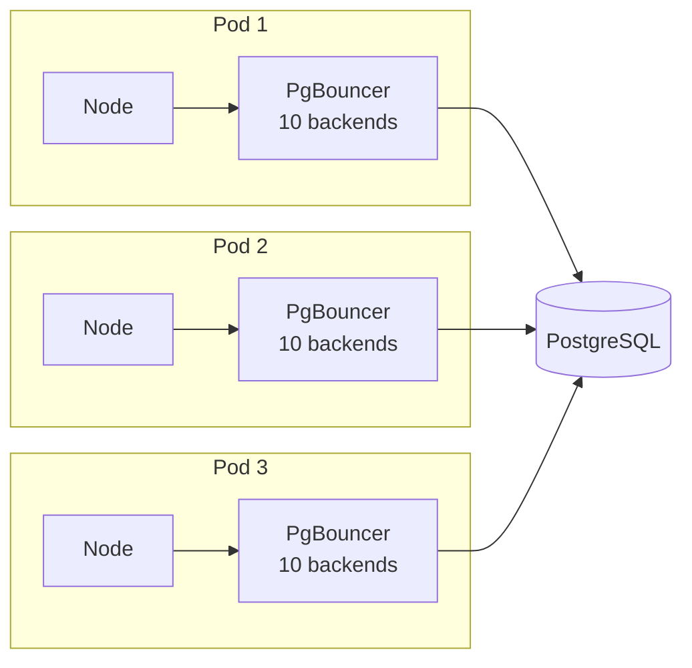

Three sidecars can therefore create up to 30 PostgreSQL connections. A shared PgBouncer can enforce one global backend budget:

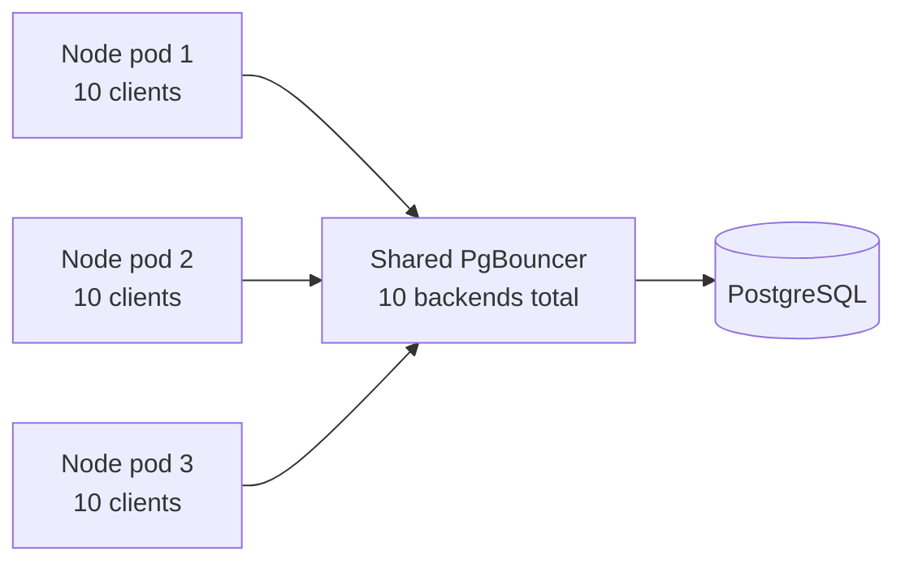

## Safer design for long publish workflows

A two-minute publish should not keep an HTTP request and database transaction open while it calls several external systems.

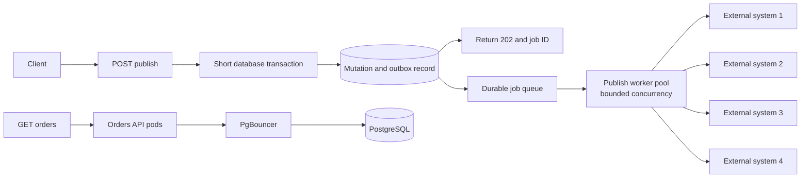

## Next experiments — not conclusions yet

| Question | Controlled experiment |
|---|---|
| Where does PgBouncer help? | Direct Postgres versus transaction pooling under many mostly idle clients; hold workload and backend budget comparable |
| What changes in session mode? | Session versus transaction pooling with persistent Node pools; observe pinned server connections |
| Does a bigger pool help? | Change Node pool size, then PgBouncer backend budget separately; measure throughput and DB resource pressure |
| Does vertical scaling help Node? | One API with 1 versus 2 CPU quota on `/cpu`; then compare multiple processes or worker threads |
| Does horizontal scaling help? | Keep PgBouncer budget fixed while changing API replicas; compare CPU work and slow SQL |
| What happens before scaling catches up? | Fixed arrival rate with bursts; add replicas after a measured delay and observe backlog/drain time |
| How should overload be handled? | Bounded admission queue, early rejection, deadlines, cancellation propagation, and retry budgets |
| Can slow work be isolated? | Separate fast/slow concurrency budgets; then separate processes, keeping total DB budget fixed |
| What does a real slow query do? | Add a deterministic dataset, expensive query, lock holder, and long/idle transaction as separate cases |
| Shared or per-pod PgBouncer? | Compare topologies and count total Postgres connections as replicas increase |
| Do Go or Rust change the result? | Reuse the same workload and DB budget; compare process scheduling and queue location |

For a vertical experiment, recreate the API with `API_CPUS=2 docker compose up -d --scale api=1 --wait`. Return to defaults with `API_CPUS=1 docker compose up -d --scale api=1 --wait`. CPU quota is a ceiling, not a reserved core. Node can use more threads internally, but a synchronous JavaScript callback runs on one JavaScript thread in this API.

The 60s Postgres statement timeout starts when the command reaches Postgres; it does not include the upstream Node/PgBouncer queues. Node acquisition timeout and PgBouncer query-wait timeout are both initially 15s, so later overload experiments must vary them separately to identify which deadline fired.

References: [PgBouncer pooling modes](https://www.pgbouncer.org/usage.html), [pool and timeout settings](https://www.pgbouncer.org/config), [node-postgres pool](https://node-postgres.com/apis/pool), [Node event-loop blocking](https://nodejs.org/en/learn/asynchronous-work/dont-block-the-event-loop), [Postgres statement timeout](https://www.postgresql.org/docs/17/runtime-config-client.html).
